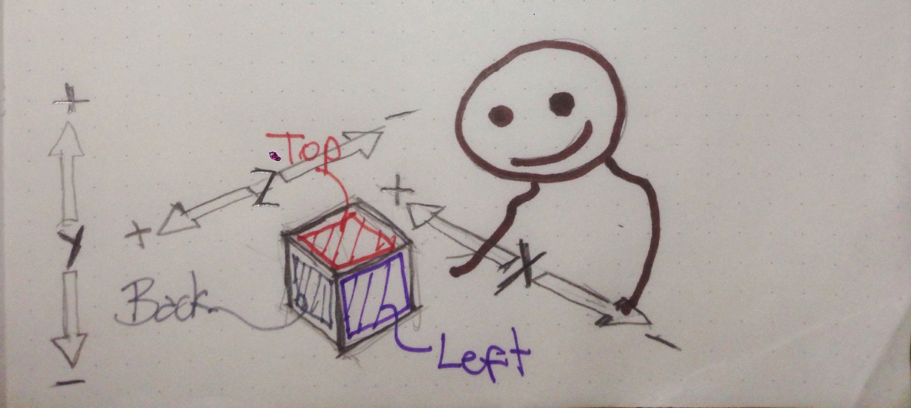
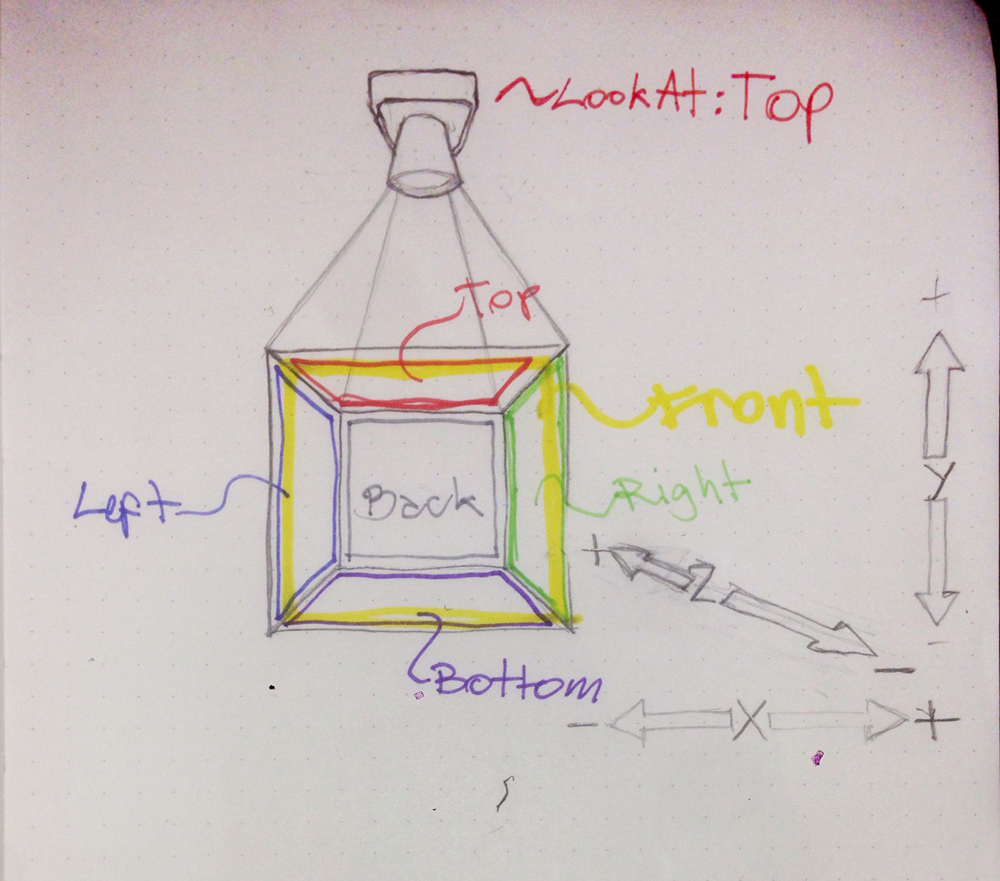

# ofxInfiniteCanvas
Infinitely zoomable and scrollable 2D canvas addon for openFrameworks.

#IMPORTANT!
You can achieve almost the same functionality of this addon when using openFrameworks 0.10 or newer. 

For such you'll need to use an `ofEasyCam` object.
The major difference is that you'll NOT be able to save or load and use the `lookAt(...)` function as it is used in this addon. Although `ofEasycam` has a `lookAt(...)` function (inherited from `ofNode`) it will not behave in the same way.

Example:

In the `ofApp.h` file declare an `ofEasyCam` object

`ofEasyCam cam;`

Then in the `ofApp.cpp` in 

    ofApp::setup(){
        // here also goes what ever else you need to setup of course

        cam.removeAllInteractions();
        cam.addInteraction(ofEasyCam::TRANSFORM_TRANSLATE_XY,OF_MOUSE_BUTTON_LEFT);
        cam.addInteraction(ofEasyCam::TRANSFORM_TRANSLATE_Z, OF_MOUSE_BUTTON_RIGHT);
		
        cam.enableOrtho();
        cam.setNearClip(-1000000);
        cam.setFarClip(1000000);
        cam.setVFlip(true);

    }

## Usage
It is really simple to use, quite much as ofEasyCam.

You can also change the lookAt position so this will emulate the left, right, top, bottom, front and back orthographic projections like in 3D CAD software.

Check the examples.

### Available Methods
**begin and end**

Like the other cameras in OF. What you want to be drawn on this canvas must be drawn after calling begin() and before calling end(). You must call both for it's correct functioning.

Optionally  you can pass an ofRectangle to the begin() method for it to be the viewport. This means that all will be drawn inside such rectangle and mouse interactions will only happen inside of it.

	virtual void begin(ofRectangle viewport = ofGetCurrentViewport());
    virtual void end();
Example:

	//in ofApp.h 
	ofxInfiniteCanvas cam;

	//-------------------
	//in ofApp.cpp
	
	void draw(){
		//...
	cam.begin();
	
		//draw whatever you want to be seen by the camera.
	
	cam.end();		
		//...
	}

**Reset**

	Calling this method will reset the canvas transformations leaving it with coordinates 0,0,0 in the middle of the window (or viewport) and set scale to 1, which is no scaling.
	
    void reset();

**Mouse Input**

    void enableMouseInput(bool e = true);
    void disableMouseInput();
    bool getMouseInputEnabled();

### Avalible Parameters
**FlipY** 

just flips the Y coordinates to match your needs (OF and openGL are Y flipped related to each other, so this might get handy sometimes. )

    void setFlipY(bool bFlipped);
    bool getYFlipped(){return bFlipY;}
    
**Translation and scale**

Conceptually speaking, it is easier to think of this addon as a camera rather than a canvas. So when scaling and translating (setting its position) think of it as a camera, that you are moving in world space. So, if you translate it, say 200 pixels on the x axis, what you see on screen will move 200 pixels to the left (x axis increases from left to right), just like it would if you moved a camera. (Now I'm questioning why I changed the name of this addon. :P )
Use the following to set this cameras position programatically. Make it follow something or whatever.

    ofVec3f getTranslation(){return translation;}
    void setTranslation(ofVec3f t);
    float getScale(){return scale;}
    void setScale(float s);
    
**LookAt**

There are 6 possible lookAt positions (places from where you look at the scene).
If you had a cube, which has 6 faces, if you kept it still, you could easily say wich are the front, back, left, right, top and bottom faces from your point of view. These also happen to be somehow the world coordinates on your screen. So if you stay in that position you could tell the camera that you want to lookAt the front of that cube, or the left side of it, or wich ever. Some drawings might be better..

    void setLookAt(LookAt l);
    LookAt getLookAt();
	
	These methods pass or receive the following:
	
	OFX2DCAM_FRONT
    OFX2DCAM_BACK,
    OFX2DCAM_LEFT,
    OFX2DCAM_RIGHT,
    OFX2DCAM_TOP,
    OFX2DCAM_BOTTOM
Example:

	ofxInfiniteCanvas cam;// I just got used to call it cam and not canvas. sorry.
	cam.setLookAt(OFX2DCAM_TOP);
	Which would be somehting like this.
	

**drag Sensitivity**

Use it to set the sensitivity (how fast or slow) when zooming by dragging with the right mouse button. default is 1.

    void setDragSensitivity(float s);
    float getDragSensitivity(){return dragSensitivity;}
    
**scroll sensitivity**

The same as the previous one but for zooming with the scrollwheel/trackpad gesture. Default is 10.

    void  setScrollSensitivity(float s);
    float getScrollSensitivity(){return scrollSensitivity;}

**Drag**

When you realese the mouse while dragging the camera will keep moving a little bit more and ease out until stopping. It is not really much but it gives it a more natural feeling. Default is 0.9. if 1 it will not stop moving when you release the mouse, if zero it will stop inmediately.
	
    void setDrag(float drag);
    float getDrag() const;

**Near Clip and Far Clip**

OpenGL needs to know how far are the furthest things it has to render or the closest ones. Often this constraints will not be enough, so set these as you need.
Defaults are far 2000 and near -1000. The latter  means that objects behind the camera will be renderer, which might sound odd but in this case as it is an ortographic projection it happens to be handy as to be able to draw all the objects in the scene, specially when you set the lookAt other than front.

    void setNearClip(float nc);
    float getNearClip(){return nearClip;}
    
    void setFarClip(float fc);
    float getFarClip(){return farClip;}

### GUI
All the previous parameters can be used super easily with ofxGui.
For such there is the following property, which has been already set up for you.

    ofParameterGroup parameters;

So, if you want to use it on a gui do the following.

On ofApp.h
	
	...
	ofxInfiniteCanvas cam;
	ofxPanel gui;
	...
On ofApp.cpp

	void setup(){
		//...
		gui.setup();
		gui.add(cam.parameters);
		//then add whatever else you might need in the gui.
		//...
	}
	void draw(){
	//...
	cam.begin();
	
	//draw whatever you want to be seen by the camera.
	
	cam.end();
	
	gui.draw();//Notice that it is outside begin and end!.
		
	}
	
### Utilities    
**coordinate space conversion.**

So if you want to know the real cordinates of something onscreen, like your mouse pointer you will use screenToWorld. Pass the screen coordinates and you will get the world coordinates.
    
    ofVec3f screenToWorld(ofVec3f screen);
  
Or if you want to know the screen coordinates of an object you have, so for instance to tell whether it is inside or outside the screen.

	ofVec3f worldToScreen(ofVec3f world);

the previously mentioned example can be done super easily, like this:

	ofVec3f myObjectPosition; //in world space.
	ofVec3f myObjectOnScreenPosition = cam.worldToScreen(myObjectPosition);
	//assuming that we have and ofxInfiniteCanvas object named cam.
	
	
	//if you haven't used the ofRectangle class, you should. It is super useful. You'll love it.
	ofRectangle screen(0,0,ofGetWidth(), ofGetHeight());
	
	if(screen.inside(myObjectOnScreenPosition)){
		//your objects position is on screen! 
	}else{
		// it is not on screen.
	}
	//the ofRectangle inside method returns true if the coordinates you pass to it are inside of the rectangle itself. Super extra usefull for making buttons, fitting things on screen, etc...
	
**Save and load**

Quite straight forward. just pass the path to the file from where to save or load.
The filename must end with ".xml"

	void save(string path);
	bool load(string path);

### Other Methods
**Update**

Might be useful if you need to override it somehow, but for everyday use you souldn't worry as it is handled internally.

    void update();

**drawDebug**

It will draw onscreen the current translation, scale and clicPoint (where you clicked and started dragging) which is in screen coordinates.

    void drawDebug();

### Experimental
Try this one at your own risk ;)
If set to true it will override ALL of openFrameworks mouse events so these are in world space and not screen space, so you dont need to worry about transforming when you try to hit or grab anything. It is experimental as it kind of hijacks the mouse events and modifies them. I haven't had any problems with it but it might, that's why it is experimental. It will work incorrectly with anything drawn outside the begin() and end(). So, for example if you want to use an ofxGui object, you will have to place it's draw function between begin and end, and not outside.

    void setOverrideMouse(bool b);
    bool isMouseOverride(){return bMouseOverride;}

## Compatibility
Developed with OF 0.9.3, but should work with either newer or older versions.

## Notes

This addon used to be called ofx2DCam. I changed the name as this is more catchy :) as well as it reflects better the idea of the addon.
If you have ofx2DCam addon installed, remove it and install this one, as it will not be updated any longer.
